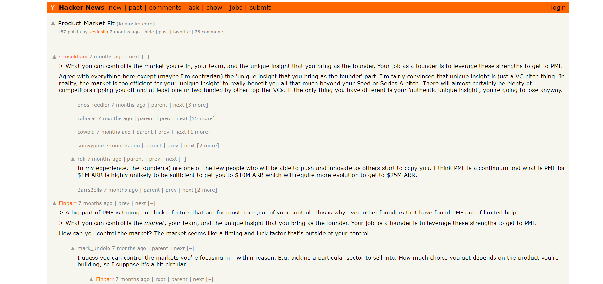

# Hacker News YCombinator Alumni username highlighter
## Changes colour of YC Alumni to orange in HN

This browser extension (tested in Chrome) changes the color of YC Alumni usernames on Hacker News, replicating one of the more trivial YC alumni perks.

# Example

## Limitations

The extension fetches a list of usernames from a [.txt in a github gist](https://gist.github.com/emilonpt/4042c34b5214eadd6d875c23c16f2838) that is manually updated by running `updater.py` to scrape [HN's /launches list](https://news.ycombinator.com/launches) for post authors and keep the list of YC Alumni up to date - this is done "at will" - feel free to run `updater.py` yourself and point the extension somewhere else by changing the `url` variable on `script.js` (and the permissions on `manifest.json`) if you'd like to udpate the list more often.

Note as well that this means the extension is limited by the launches listed in the `/launches` list - as of June 11, 2023, the furthest accessible launch dates back to January 10, 2017.

## Installation

1. Clone this repository: `git clone https://github.com/yourusername/username-highlighter.git`
2. Navigate to `chrome://extensions/` in Chrome.
3. Enable Developer mode (toggle switch at the top right).
4. Click "Load unpacked" and select the `username-highlighter` directory.

## Usage

Once installed, the extension will automatically change the color of YC Alumni on `https://news.ycombinator.com/*` URL's.

## Contributing
Issues, feature requests, bug reports, and PR's are all welcome.